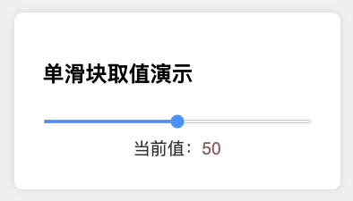
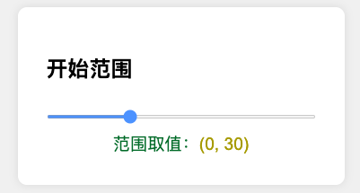
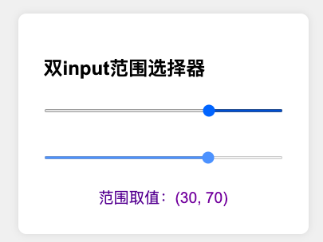
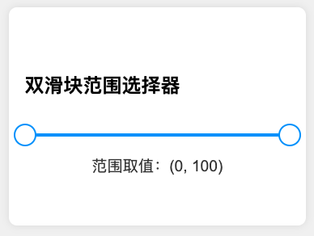

# 原生双滑块范围选择器 Demo

> 一个**零依赖、纯原生**（HTML + CSS + TypeScript → JavaScript）的可视化范围选择器示例，包含  
>
> 1. 单滑块取值演示
> 

     
  

> 2. 开始范围演示
> 

     
  

> 3. 结束范围演示
> 

     
  

> 4. 两个独立 `input[type=range]` 组合的“上下限”选择  
> 

     
  

> 5. 自定义轨道与圆形拖拽点的 **双滑块**（视觉握柄）范围选择器  
> 

     
  

>
> 代码展示式递进式的，从最初的input取值、取范围到两个input形成两端的范围取值到最后放弃input自定义完成双滑块范围取值器。

---

> **说明**   
> - `src/` 与 `dist/` 的目录划分仅用于演示，正式项目可根据习惯调整。  
> - 如无 Node.js 环境，可删除 `src/*.ts` 并直接在 `index.html` 中引用手写的 JS。  