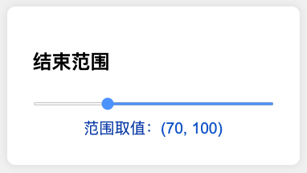

# 自主实现双滑块范围选择器

> 一个**零依赖、纯原生**（HTML + CSS + TypeScript → JavaScript）的高级范围选择器示例，展示从基础输入控件到完全自定义双滑块的实现过程

## 功能展示

1. 单滑块取值演示

    

2. 开始范围演示

    

3. 结束范围演示

    

4. 两个独立 `input[type=range]` 组合的"上下限"选择  

    

5. 自定义轨道与圆形拖拽点的双滑块范围选择器  

    

## 实现亮点

- **递进式开发思路**：从最简单的单滑块到完全自定义的双滑块范围选择器，展示了控件开发的完整思路
- **完全原生实现**：不依赖任何第三方库或框架，展示了原生Web技术的强大能力
- **自定义双滑块**：突破原生input[type=range]的限制，实现单轴上的双滑块联动效果
- **防止滑块碰撞**：智能处理两个滑块重叠的情况，确保最小值不会超过最大值
- **精确值计算**：根据鼠标位置精确计算和反映滑块位置，支持拖拽和点击定位
- **直观视觉反馈**：选定范围高亮显示，拖拽时实时更新显示值
- **无障碍支持**：考虑键盘操作和屏幕阅读器支持

## 技术要点

- **面向对象的TypeScript实现**：使用类和接口构建可维护的代码结构
- **自定义事件处理**：精确捕获和处理鼠标事件，实现平滑拖拽体验
- **DOM操作优化**：高效创建和更新DOM元素，确保流畅的交互体验
- **CSS变量与计算**：动态设置和计算样式，实现响应式设计
- **渐变与阴影效果**：使用CSS实现美观的视觉效果

## 应用场景

- 价格范围筛选
- 日期范围选择
- 数据区间过滤
- 音量或亮度等双向调节控制
- 任何需要在连续数值中选择范围的场景

代码展示了递进式的实现方法，从最初的input取值、取范围，到两个input形成两端的范围取值，最终放弃input元素完全自定义实现双滑块范围选择器。每一步都有详细的代码注释，便于理解和学习。

---

> **说明**    
> - 如无 Node.js 环境，可删除 `*.ts` 并直接在 `index.html` 中引用手写的 JS。
> - 最终实现的双滑块选择器解决了原生HTML控件无法在单轴上实现双滑块的限制。 