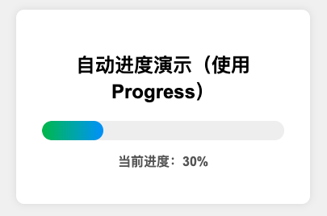
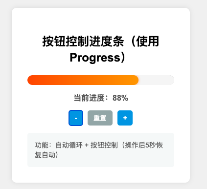
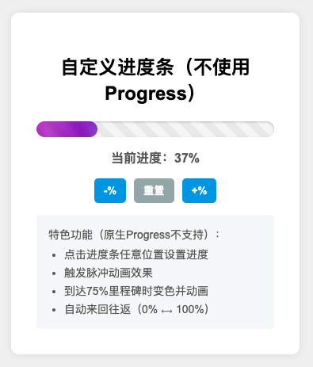

# 高级进度条效果演示

> 一个**零依赖、纯原生**（HTML + CSS + TypeScript → JavaScript）的多种进度条效果示例，从基础自动进度到自定义高级效果

1. 基础自动进度演示

    

2. 美观进度条（使用原生Progress元素）

    

3. 自定义进度条（不使用Progress元素）

    

## 功能特点

- **所有进度条共有特性**：
  - 自动连续移动
  - 进度标准化显示
  - 移动到100%后自动重置或反向

- **美观进度条（使用原生Progress）**：
  - 按钮控制：+10%、-10%、重置
  - 渐变色过渡效果
  - 响应式设计

- **自定义进度条（不使用Progress）**：
  - 点击进度条任意位置直接设置进度（原生Progress不支持）
  - 脉冲动画效果：点击或达到里程碑时触发
  - 达到75%时的里程碑效果：变色并缩放动画
  - 自动来回往返（0% ⟷ 100%）
  - 波光闪烁与斜纹纹理效果

## 技术亮点

- 零依赖纯原生实现
- 面向对象的TypeScript代码
- 使用CSS变量与渐变实现视觉效果
- CSS动画与过渡效果的综合运用
- 响应式设计与移动端适配

## 设计思路

代码展示了三种不同的进度条实现方法，从基础到高级，依次展示了进度条控件的设计思路和扩展可能性：

1. 基础自动进度：展示简单的自动循环进度
2. 美观进度条：展示如何在保留原生元素的基础上添加视觉效果
3. 自定义进度条：展示如何摆脱原生元素限制，实现更丰富的交互和视觉效果

---

> **说明**    
> - 如无 Node.js 环境，可删除 `*.ts` 并直接在 `index.html` 中引用手写的 JS。
> - 截图仅供参考，实际效果需要运行代码查看，尤其是动画效果。 