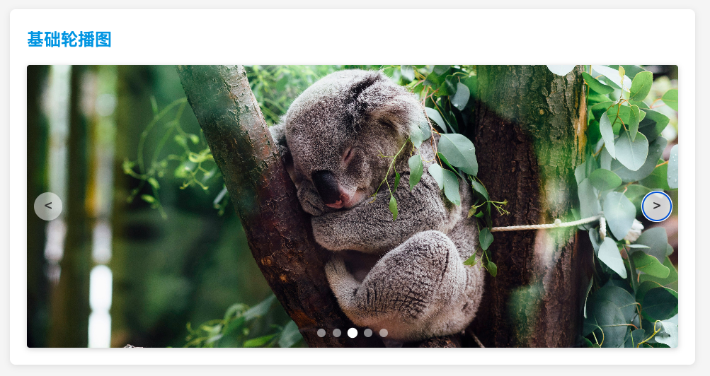
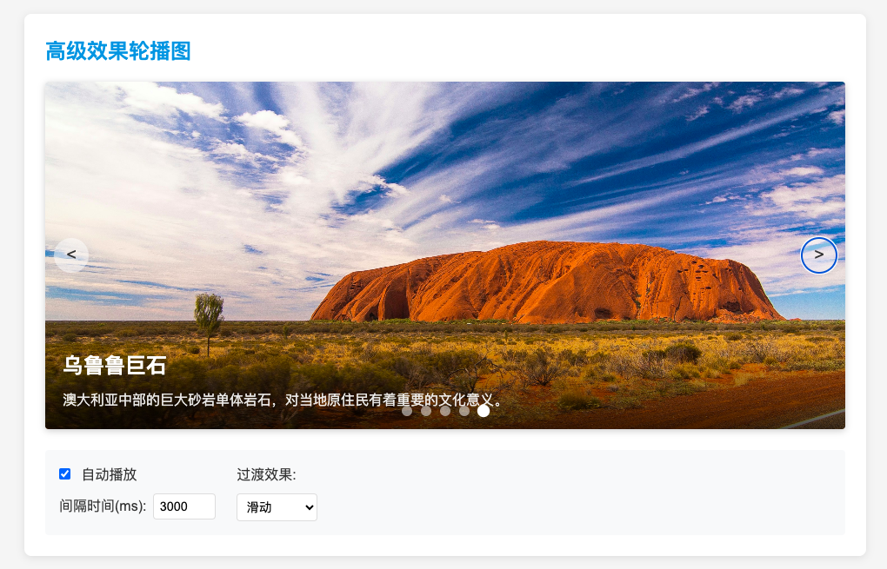

# 原生图片轮播图实现

> 一个**零依赖、纯原生**（HTML + CSS + TypeScript → JavaScript）的图片轮播图组件，实现从基础轮播到高级特效的多种功能，展示澳大利亚美景和特色

## 功能展示

1. 基础轮播图

    

2. 高级特效轮播图

    

## 功能特点

- **基础轮播图**：
  - 左右切换按钮
  - 指示器导航
  - 自动播放
  - 悬停暂停

- **高级轮播图**：
  - 四种过渡动画效果（滑动、淡入淡出、缩放、翻转）
  - 图片标题和描述显示
  - 可调整的自动播放间隔
  - 开关自动播放功能
  - 悬停显示详细信息

## 技术亮点

- **面向对象设计**：使用类继承实现基础功能和扩展功能的分离
- **类型安全**：完整的TypeScript类型定义确保代码稳定性
- **纯CSS动画**：使用CSS transitions和transforms实现流畅过渡效果
- **响应式设计**：适配不同屏幕尺寸
- **用户交互优化**：直观的控制元素和反馈效果
- **无依赖实现**：不依赖任何第三方库或框架
- **本地图片加载**：支持加载本地图片资源，无需依赖外部网络
- **灵活图片源**：可以使用本地图片、网络图片或占位图片

## 实现要点

- **动态DOM操作**：运行时生成轮播图项和指示器
- **事件处理**：管理点击、悬停等用户交互事件
- **定时器控制**：实现自动播放和暂停功能
- **CSS变量应用**：使用CSS变量控制过渡效果
- **跨浏览器兼容**：确保在各主流浏览器中正常工作

## 应用场景

- 旅游景点展示
- 特色动物介绍
- 旅行目的地宣传
- 度假胜地推荐
- 景区图片集

## 扩展可能性

本实现提供了一个可扩展的基础，可以进一步添加：

- 触摸屏滑动支持
- 键盘导航
- 无限循环滚动
- 多图同时展示
- 自定义缩略图预览

> **说明**    
> - 如无 Node.js 环境，可删除 `*.ts` 并直接在 `index.html` 中引用手写的 JS。
> - 截图仅供参考，实际效果需要运行代码查看，尤其是动画效果。
> - 展示了澳大利亚的著名景点和特色动物，包括悉尼歌剧院、袋鼠、考拉、黄金海岸和乌鲁鲁巨石。
> - 代码演示使用在线占位图片，可根据需要替换为实际图片。