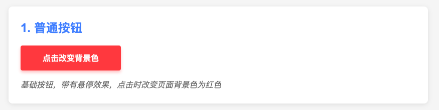
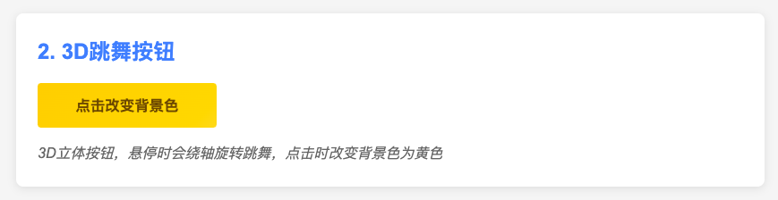
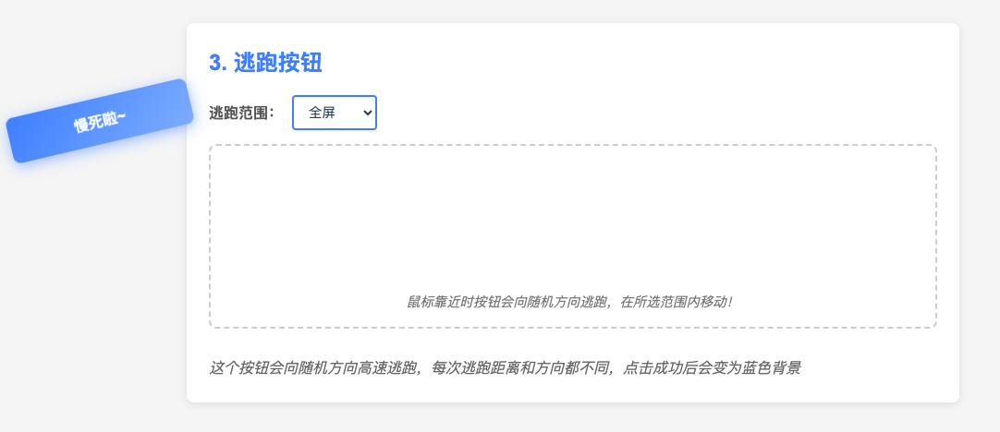

# 会跳舞的3D按钮与逃跑按钮

> 一个**零依赖、纯原生**（HTML + CSS + TypeScript → JavaScript）的交互式按钮集合，包含3D动画效果和鼠标追踪逃跑行为，展示从基础按钮到高级交互的实现过程

## 功能展示

1. 红色普通按钮

    

2. 黄色3D跳舞按钮

    

3. 蓝色逃跑按钮

    

## 功能特点

- **红色普通按钮**：
  - 基础悬停效果
  - 点击改变背景色
  - 平滑过渡动画

- **黄色3D跳舞按钮**：
  - 真正的3D立方体结构（六个面）
  - 悬停时多轴复杂旋转动画
  - 渐变色立体效果
  - 点击改变背景色为黄色

- **蓝色逃跑按钮**：
  - 鼠标靠近自动逃跑
  - 随机方向与随机距离移动
  - 范围可选（全屏或容器内）
  - 旋转与位移混合动画
  - 捕捉到按钮（点击成功）改变背景色为蓝色

## 技术亮点

- **CSS 3D变换**：使用`transform-style: preserve-3d`和`perspective`实现真正的3D空间
- **复杂关键帧动画**：结合旋转、缩放和位移创建流畅复杂的动画效果
- **鼠标位置追踪**：精确计算鼠标与元素的距离和角度关系
- **随机运动算法**：为逃跑按钮生成随机逃跑路径，提高游戏性
- **可配置移动范围**：支持在全屏或容器内移动的选项
- **自适应文字颜色**：根据背景色自动调整文字颜色，确保可读性
- **响应式设计**：适配不同屏幕尺寸的布局调整

## 设计思路

代码展示了三种不同层次的按钮交互设计思路：

1. **基础交互**：展示简单、直观的按钮效果和状态变化
2. **视觉增强**：使用3D变换和动画提升视觉吸引力
3. **复杂交互**：实现基于用户输入的智能反应，创造游戏化体验

这种递进式的实现思路展示了从基本到高级的用户界面交互可能性，强调了如何通过原生技术创建引人入胜的用户体验。

## 应用场景

- **网站CTAs**：吸引眼球的行动呼吁按钮
- **游戏界面**：互动性强的游戏菜单按钮
- **儿童教育应用**：有趣且吸引注意力的互动元素
- **用户体验设计**：展示创意交互可能性的原型
- **主题切换**：创意的主题/颜色选择器

---

> **说明**    
> - 如无 Node.js 环境，可删除 `*.ts` 并直接在 `index.html` 中引用手写的 JS。
> - 截图仅供参考，实际动画效果需要运行代码查看。
> - 跳舞/逃跑按钮的交互需要鼠标操作体验，截图无法完全展示其动态行为。
